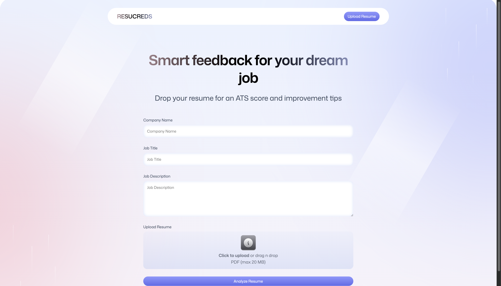
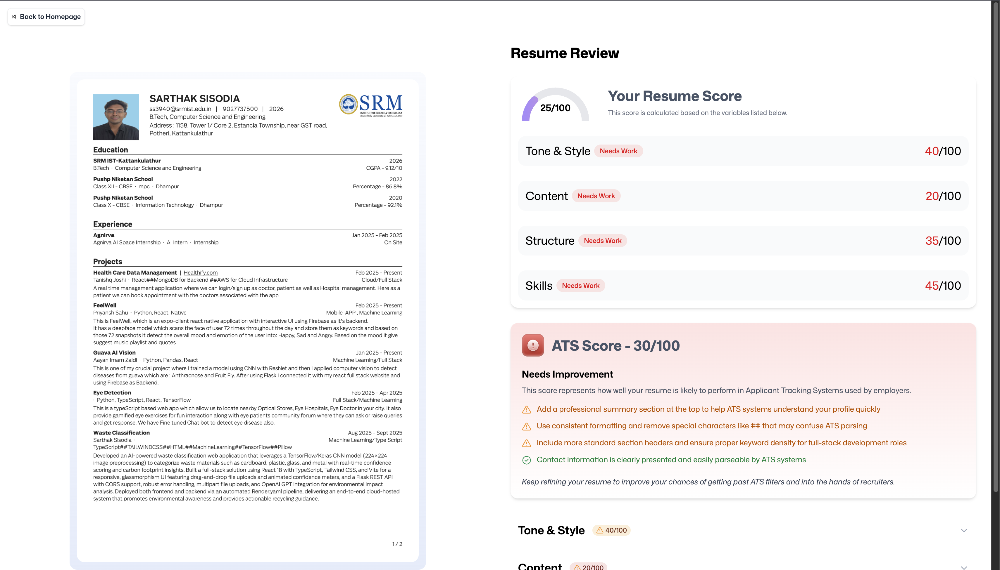
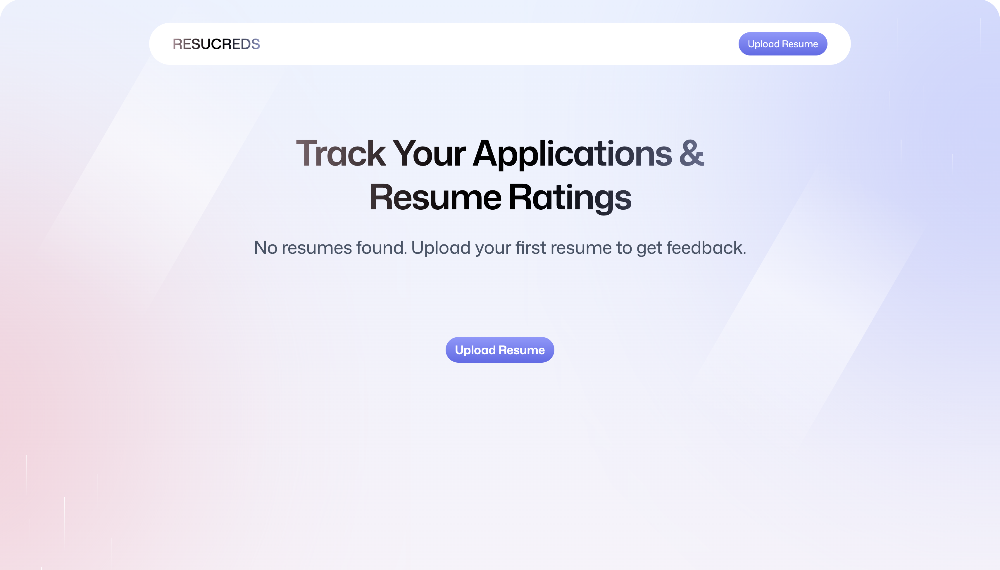

# AI Resume Analyzer

A web app built with React + TypeScript that helps users analyze their resumes using AI.  
You can upload a PDF, it gets converted to an image, analyzed by an AI model (via Puter.js),  
and you get an ATS score + feedback on how to improve your resume.

---

##  Features (Web)

-  Auth handled by Puter.js (login, logout, persistent session)
-  PDF upload & conversion to image
-  AI resume feedback using Claude / Gemini / GPT models
-  ATS scoring and structured feedback
-  Sections for tone, content, and skills
-  Responsive React + Tailwind UI
-  Routing handled with React Router v7
-  TypeScript used throughout

---

##  Screenshots

| Page | Preview |
|------|----------|
| Upload |  |
| Feedback |  |
| ATS Dashboard |  |
| Auth Page |  |

---

##  Setup Instructions

```bash
# Clone the repo
git clone https://github.com/IamSarTech/ai-resume-tracker.git
cd ai-resume-tracker

# Install dependencies
npm install

# Start the dev server
npm run dev
